# Viola Jones Face Detection with Eigen Face Recognition

###### Praveen Venkatesh

----------------------

A link to a Google Colab file can be found here: [Colab](https://colab.research.google.com/drive/1Gfc4v2b_00aLaUDOrl-nqscd-wwTPTEM)

## Approach

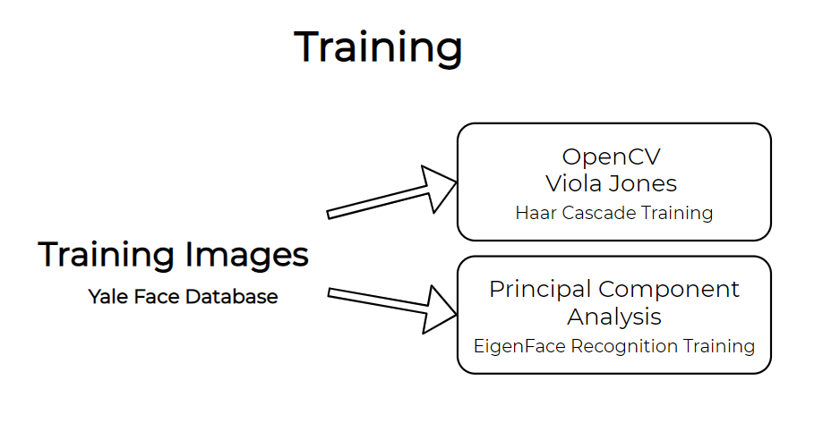


### EigenFace recognition

In this method, we use the principal component analysis technique in order to efficiently detect whether a particular face has already been seen before or not.

Training Algorithm:

- Find the mean face from the given dataset
- Subtract each face from the mean face to normalize the faces.
- Flatten the face vectors into a column vector, and append into a matrix. If we have  M  training samples, then the matrix will have dimensions  M \times N^2  where the image is of dimensions  N\times N 
- Compute the covariance matrix of the training matrix. Instead of having a covariance matrix of  N^2 \times N^2 , we will find the covariance matrix that is of  M \times M   dimensions. This is done to improve resource usage, and speed up computation since finding the Eigenvalues for large matrices is slow.
- Find the Eigenvalues and Eigenvalues of the covariance matrix.
- Project the training faces onto the Eigenspace. This gives the Eigen faces that we need. The Eigenfaces form the basis vectors for the Eigenspace.
- Retain  k  largest Eigenvalues and Eigenvectors. This  k  can be chosen by plotting the Eigenvalues vs its rank in terms of largeness.
    - This basically represents the fact that there are some Eigenvectors that do not bring as much variance into a particular face, and hence can be neglected.
- We represent each training face as a linear combination of the Eigenfaces. The multiplying factors are stored as weights.

The weights are essentially what remain after "training" the algorithm.

Recognition:

- After taking a face, flatten the face, and normalize by subtracting from the mean face.
- Convert the face into the Eigenspace by representing in terms of its weights.
- Compare the weights of the image with every other weight in the training set. 
- The weight from the training set that matches closest with the input image weight is the predicted weight, and hence the predicted person!


Here is the computed mean face:

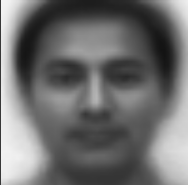

Here is a normalized face compared with the original face:

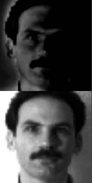

Here is a plot of the Eigenvalues:

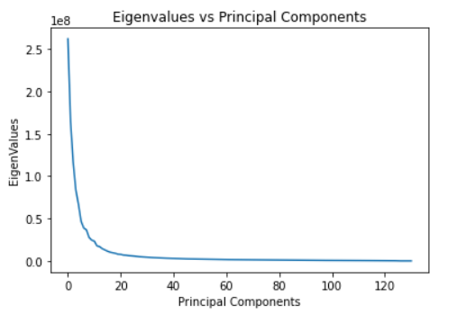

We can see that at around 20 principal components, the variance offered by each Eigenface flattens out.


Here are the heaviest few Eigenfaces:

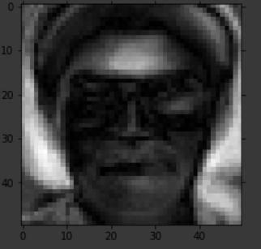


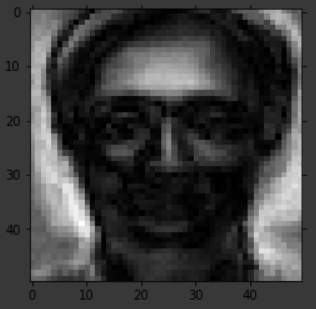


This is the lightest Eigenface:

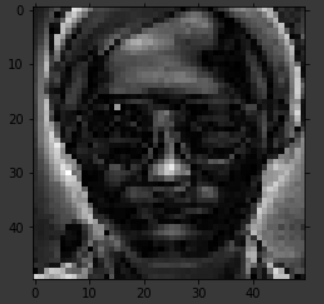


### Viola - Jones Algorithm


The Viola Jones algorithm was introduced in 2001, and is a form of an Ensemble Classifier.

An ensemble classifier is basically a collection of several weak classifiers. Weak classifiers are poor classifiers and perform just a tad bit better than guessing. However, by combining several thousand of these weak classifiers together, we can essentially achieve excellent accuracy, and perform much better than random guessing!

Here, in the method that Viola and Jones proposed, we use several different features that make up the weak classifiers. For example, we take rectangular features, and use that to predict whether that particular feature correctly corresponds to that face.

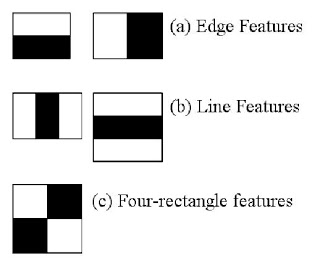

In the above image there are some rectangular features that can be seen. We take such regions (the entire rectangle), and the compute the sum of the pixels of the sub-regions within the rectangle. Now, we take a difference between these particular rectangles.

Now, computing these features in a huge image that has only a small portion marked as the face will be extremely intensive in terms of computational resources. Hence, the authors proposed the intermediate stage of an integral image. 

Where  A  refers to the integral image, and  a  refers to the original image. Using this concept, finding the sum of the pixels in a  m \times n  area reduces from  m\times n  calculations to simply 4 additions! We would just need to take the corners of the region of interest and then compute the integral image.


One such example of an integral image from the yale face database is given by:

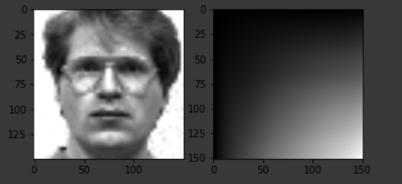

Here, the second image is normalized. i.e, normalized to the maximum value so that it can be plotted as a grayscale image. We can see that it looks like a gradient image with an increasing value to the bottom left corner. To compute one of these features, we simply take the bottom right corner of the area we want to compute, and then remove the parts we don't want in our region.


Now, we try to generate many thousands of these haar-like features and use these ensemble of weak classifiers to create a Haar Cascade Classifier.

During the training phase, a moving window traverses the entire image. For each feature that we choose in a subwindow, we train a feature classifier that uses that particular feature to make a prediction. We compute the error of this particular classifier in classifying the image, and then update the weight of this particular classifier in the next stage of the training process. There are primarily 3 types of features that are used, but these features vary in size and weight throughout the image, and the best ones are chosen.

For example, the top two best features chosen are:

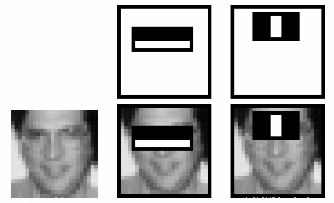

These are learnt features from the training set. Similarly, the authors decided to use 6000 of such features, with 38 cascaded stages.


During the detection phase, a moving window traverses the entire image, and the haar features are computed for each one of these windows. The cascaded nature of the classifier tries to speed up this process by not trying out the entire cascade set if the most important cascades are rejected. The cascades are orderd, an the classifier classifies a face only if all of the haar features classify a bounding box as a face. This speeds up the detection process by a huge margin since any premature negative outcome will result in the elimination of that particular moving window as a candidate for the object of interest.


#### Training with OpenCV


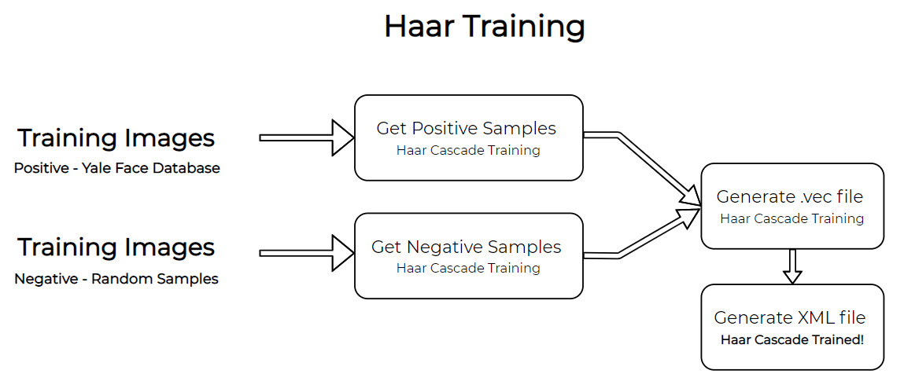


Since there are computational constraints, and the training process takes a significantly long time, I am restricting to training on only the 160 images that are present in the Yale Face Database.

There are 2 primary approaches that can be taken to train such a classifier using the Yale database:

- Take N positive sample (images with a face) and M negative samples, and generate a .vec file for opencv to train on
- Take 1 positive sample and M negative samples. Apply transformations and generate M positive samples. Use these samples to train.
- Use a mix of methods 1 and 2.

In this approach, we are using the first method by utilizing the entire Yale face database. This is significantly better than the second method since it doesn't overfit to that one particular face, and better than method 3 by reducing training time.


## Results

The entire testing flow is shown below:

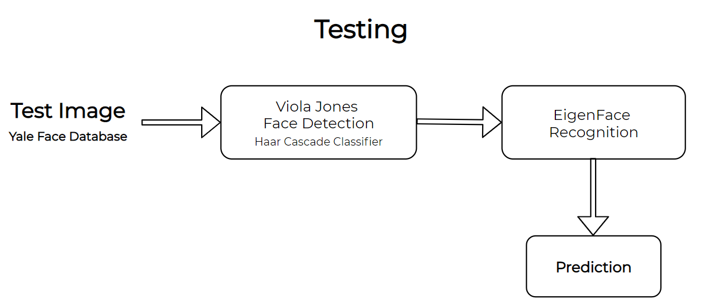


The entire system was trained on ~130 images for both the face detection and recognition. The recognition part had 15 subjects.

First, running the test on our train set, we should get 100% accuracy on EigenFaces since there is always a match. As expected, we get the following results:

```
Successes of both Detector and Recognition =  131
Detection Failures =  1 | Recognition Failures =  0
Total Pictures=  132
Accuracy of Face Recognizer =  100.0
```
Plotting the confusion matrix:

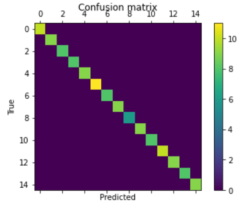


The Viola Jones detector managed to get about 80% of the test cases correctly. This is not a particularly large accuracy, and it could have been significantly better if a larger dataset was used. In contrast, the pretrained haar cascade classifier managed to get 97% of the faces correct. This is because the pretrained version has been trained on a much larger dataset, with much lower allowed tolerance values.
```
Successes of both Detector and Recognition =  12
Detection Failures =  6 | Recognition Failures =  16
Total Pictures=  34
Accuracy of Face Recognizer =  42.857142857142854
Accuracy of Face Detector =  82.3529411764706
```


The face recognition system managed to get about 61.7% of the cases correctly when used along with the pretrained haar cascade.

```
Successes of both Detector and Recognition =  21
Detection Failures =  0 | Recognition Failures =  13
Total Pictures=  34
Accuracy of Face Recognizer =  61.76470588235294
Accuracy of Face Detector =  100.0
```


Another run gave a higher result of 72% for the EigenFace detection. Hence we can see that the accuracy depends largely on the test and train set used for making the predictions.

Another run gave an accuracy of 48.48%. Here is the confusion matrix for the same:

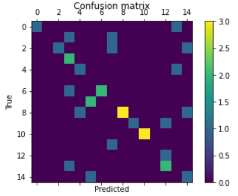

Here are some results of correct predictions:


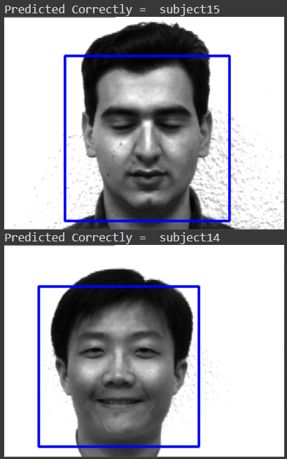


## References

1) Will Berger, "Deep Learning Haar Cascade Explained - "http://www.willberger.org/cascade-haar-explained/#:~:text=Haar%20Cascade%20is%20a%20machine,of%20Simple%20Features%22%20in%202001."


2) ML | Face Recognition Using Eigenfaces (PCA Algorithm) - "https://www.geeksforgeeks.org/ml-face-recognition-using-eigenfaces-pca-algorithm/"

3) P. Viola and M. Jones, "Rapid object detection using a boosted cascade of simple features," Proceedings of the 2001 IEEE Computer Society Conference on Computer Vision and Pattern Recognition. CVPR 2001, Kauai, HI, USA, 2001, pp. I-I, doi: 10.1109/CVPR.2001.990517.

4) M. A. Turk and A. P. Pentland, "Face recognition using eigenfaces," Proceedings. 1991 IEEE Computer Society Conference on Computer Vision and Pattern Recognition, Maui, HI, USA, 1991, pp. 586-591, doi: 10.1109/CVPR.1991.139758.


5) Training Haar Cascades - "https://memememememememe.me/post/training-haar-cascades/"

6) Bradski, G. (2000). The OpenCV Library. Dr. Dobb&#x27;s Journal of Software Tools.
